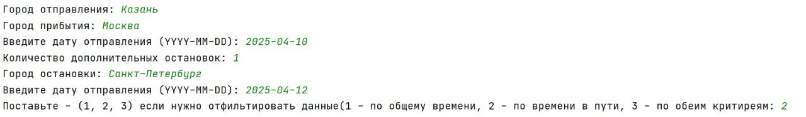
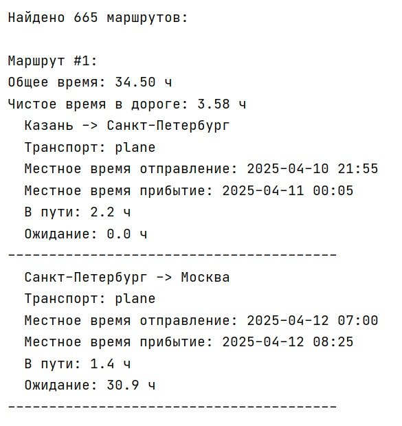

# Работа с алгоритом

## Входные данные

- Город отправки (Необходимо вести название населенного пункта с которого будет происходит отправление) - 
- Город прибытия (Необходимо вести название населенного пункта в который необходимо прибыть)
- Дата отправки (Вести дату отправление в формате YYYY-MM-DD (Например: 2025-04-10))
- Количество дополнительных остановок:
- Город остановки: (Необходимо вести название населенного пункта в котором необходимо остановится)
- Введите дату отправления (Вести дату отправление из города остановки в формате YYYY-MM-DD (Например: 2025-04-10))
- Поставьте - (1, 2, 3) если нужно отфильтировать данные(1 - по общему времени, 2 - по времени в пути, 3 - по обеим критиреям): - Фильтр по которому будет просходит ранжирование маршрутов

## Пример работы алгоритма

- Входные данные:

- Выходные данные:
